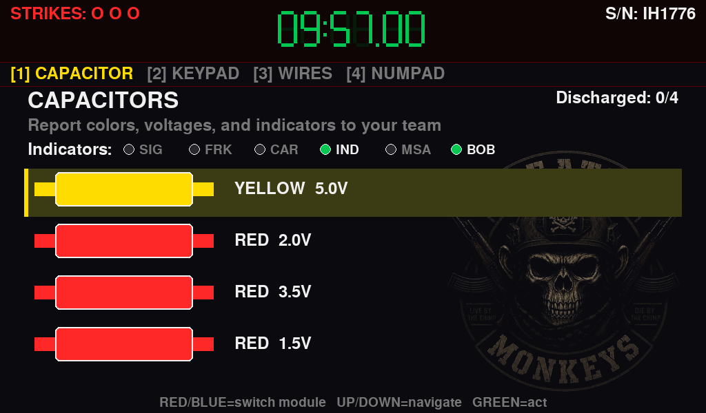
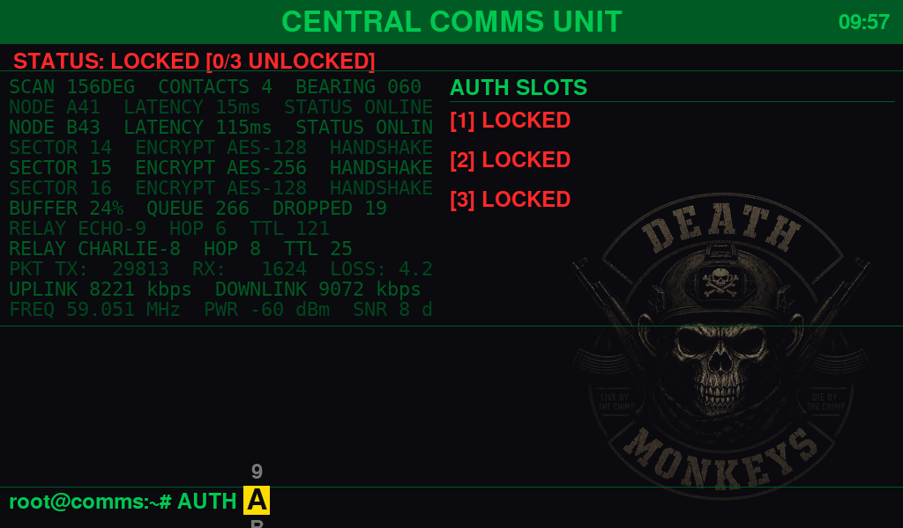
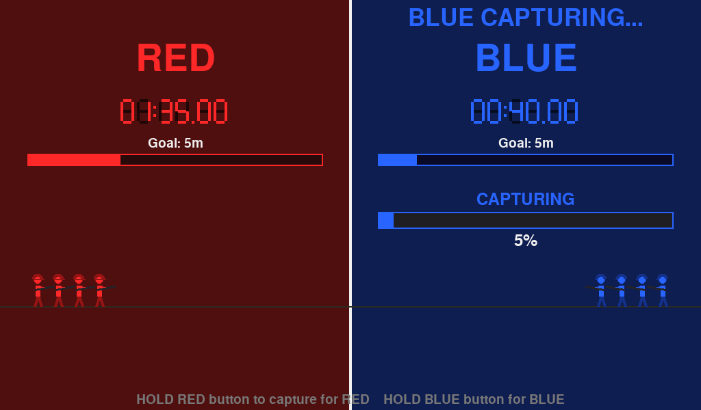
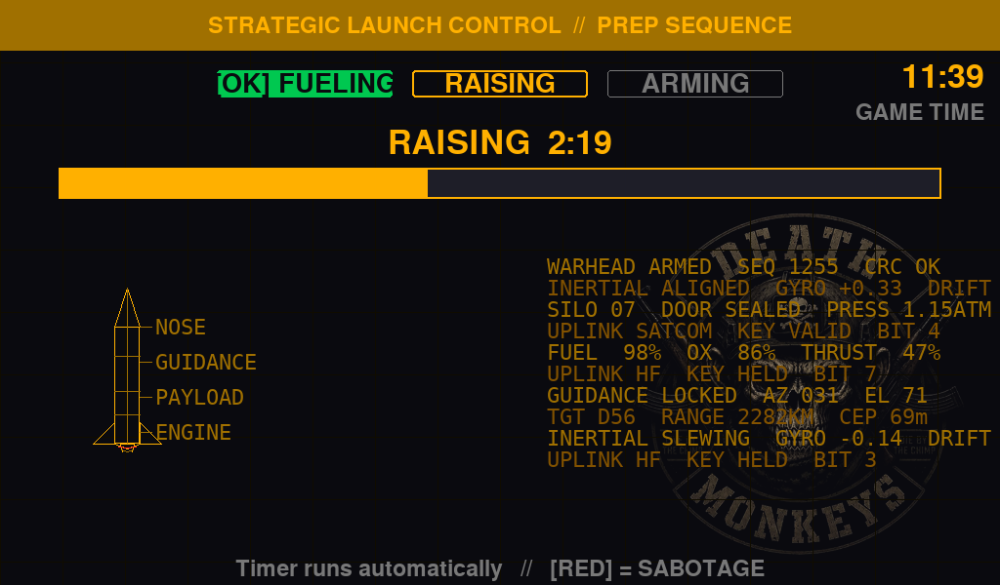

# Field Ops

Airsoft objective system built on a Raspberry Pi. Runs fullscreen game modes on a small display with physical button input, and provides a phone-friendly web control panel over a built-in Wi-Fi hotspot.

## Game Modes

### Bomb Defusal

A cooperative puzzle game inspired by *Keep Talking and Nobody Explodes*. One player interacts with the bomb on screen while teammates read the [defusal manual](docs/bomb_defusal_manual.md) over radio. Solve all modules before the timer runs out — three strikes and it detonates.

**Modules:** Wires, Keypad, Button, Capacitor Discharge, Detonator Pins, Number Pad

**Settings:** Timer (5–30 min in 5-min steps, or custom), Module count (3–6)



### Comms Array Hack

A game master sets three secret codes before the match. Players must find the codes in the field and enter them into the terminal to "hack" the comms array. Each code attempt triggers a decryption animation before revealing success or failure.

**Settings:** Timer (off, 5–30 min in 5-min steps, or custom)



### Domination

Two teams fight over a single control point. Hold your team's button to capture — release and the progress drains back. First team to accumulate the target hold time wins. Features a live stick-figure battle scene.

**Settings:** Goal time (5–30 min in 5-min steps, or custom)



### Missile Launch

One team defends a missile silo, working through Fueling, Raising, and Arming phases (hold a button to start each, then wait it out) before entering the launch code to begin the countdown. The opposing team can sabotage prep phases or abort the countdown by holding their button at the box for an extended time.

**Settings:** Game time (5–30 min in 5-min steps, or custom), per-phase duration (Fueling/Raising/Arming), launch countdown



## Hardware

- **Raspberry Pi** (tested on Pi 3B+ / Pi 4) running Raspberry Pi OS (Debian Bookworm/Trixie)
- **Display:** 1024x600 screen (HDMI or DSI)
- **Input:** USB encoder board mapped to keyboard events, or a keyboard for testing
- **Buttons used:** UP, DOWN, RED, BLUE, GREEN, START, BACK

The button-to-key mapping is configured in [`settings.py`](settings.py). To discover keycodes for your encoder board:

```bash
python3 -c "import pygame; pygame.init(); s=pygame.display.set_mode((200,200)); [print(e.key) for e in iter(lambda: pygame.event.wait(), None) if e.type==pygame.KEYDOWN]"
```

## Install

On a fresh Pi with a display and Wi-Fi connected:

```bash
git clone https://github.com/d-kholin/airsoft-objectives.git ~/airsoft
bash ~/airsoft/install.sh
sudo reboot
```

The install script handles everything:

1. Installs packages (`python3-pygame`, `python3-flask`, `hostapd`, `dnsmasq`)
2. Sets up a **FIELD-OPS** Wi-Fi hotspot (AP+STA — your existing Wi-Fi stays connected)
3. Installs and enables two systemd services
4. Auto-starts on every boot

## Web Control Panel

Connect your phone to the **FIELD-OPS** Wi-Fi network and open **http://192.168.4.1:8080**.

| Feature | Description |
|---------|-------------|
| **New Game wizard** | Pick a mode, configure settings, set comms codes if needed, and start |
| **Live screen view** | See what's on the Pi's display in real time |
| **Game state** | Current mode, phase, and time remaining |
| **Kill / Reset** | Stop the active game (with confirmation) |
| **History** | Past game results for each mode |

The wizard only appears when no game is running. During a game you see the live view, status, and kill button.

**Default hotspot credentials:**
- SSID: `FIELD-OPS`
- Password: `fieldops1`

These can be changed at the top of [`install.sh`](install.sh).

## Architecture

```
main.py                 Entry point
app.py                  Pygame game loop, command polling, screenshot capture
display.py              Screen management
input_handler.py        Button/key event handling
settings.py             Screen size, button map, colors
game_mode.py            Base class for all modes
registry.py             Auto-discovers mode classes
menu.py                 Main menu with mode selection and history viewer
ui.py                   Shared UI components (checklist menu items)
widgets.py              Shared widgets (7-segment timer, custom-timer screen)
fonts.py                Cached font loader (monospace for terminal/table UI)
presets.py              Single source of timer/module presets
history.py              Shared per-mode history load/append
sound.py                Sound effect manager (assets/sounds/*.wav)

modes/
  bomb_defusal.py       Bomb defusal mode with 6 module types
  comms_hack.py         Comms array hack with code entry
  domination.py         Two-team point capture

config_store.py         Thread-safe JSON store for comms codes
game_controller.py      Command/state bridge between web and pygame
game_registry.py        Mode metadata and configurable settings
web_server.py           Flask web control panel

install.sh              One-shot full setup script
setup_hotspot.sh        Standalone hotspot setup (called by install.sh)
raspi-box.service       Systemd unit for the game display (reference)
field-ops-web.service   Systemd unit for the web server (reference)

data/                   Runtime data (gitignored)
  comms_config.json     Current comms codes
  game_command.json     Queued command from web
  game_state.json       Current game state for web
  screen.jpg            Live screenshot
  *_history.json        Game history per mode

docs/
  bomb_defusal_manual.md  Printable manual for the expert team
```

## Services

| Service | Description | Starts after |
|---------|-------------|-------------|
| `raspi-box` | Pygame game display (fullscreen) | `graphical.target` |
| `field-ops-web` | Flask web control panel on port 8080 | `network.target` |

```bash
# Check status
sudo systemctl status raspi-box field-ops-web

# Restart after code changes
sudo systemctl restart raspi-box field-ops-web

# View logs
journalctl -u raspi-box -f
journalctl -u field-ops-web -f
```

## Development

Run windowed on a dev machine (no fullscreen, no hotspot needed):

```bash
python3 main.py --windowed
```

The web server starts automatically with the app. Access it at `http://localhost:8080`.

### Tests

The bomb-defusal solver logic is covered by tests that assert the on-screen
puzzle rules stay in sync with [the printed manual](docs/bomb_defusal_manual.md),
plus tests for the shared preset/history helpers. They use only the standard
library — no extra install needed:

```bash
python3 -m unittest discover -s tests -t .
```

## Adding a Game Mode

1. Create `modes/your_mode.py` with a class that extends `GameMode`
2. Set `name` and `description` class attributes
3. Implement `setup()`, `handle_input()`, `update()`, and `draw()`
4. Add an entry to `game_registry.py` with configurable settings
5. The mode auto-discovers via `registry.py` and appears in the menu

To support web-launched games, accept a `config` dict in `setup()` and skip manual setup screens when settings are provided.

## License

MIT
